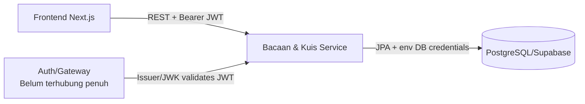

# Dokumentasi VPIC - Yomu Bacaan dan Kuis

Dokumen ini merangkum arsitektur, diagram, design pattern, integrasi, status gRPC/RabbitMQ, dan profiling untuk project Yomu. Isi dokumen mengikuti kode aktual pada:

- Frontend: `C:\adpro\IdeaProjects\group`
- Backend Bacaan dan Kuis: `C:\adpro\IdeaProjects\group\yomu-bacaan-dan-kuis`

## 1. Component Diagram

```mermaid
flowchart LR
    Student[Pelajar/Admin Browser]
    FE[Frontend Next.js\nsrc/components/modules]
    Gateway[API Gateway\nTarget arsitektur microservices]
    BK[Bacaan & Kuis Service\nSpring Boot]
    DB[(PostgreSQL/Supabase\nschema learning_mod)]
    Forum[Diskusi Forum Service\nREST :8085]
    League[Modul Liga/Statistik\nconsumer internal]
    Achievements[Achievements Service\nfuture consumer]

    Student --> FE
    FE -->|REST Bacaan/Kuis\nNEXT_PUBLIC_API_BASE_URL| BK
    FE -. target .->|REST via gateway\nNEXT_PUBLIC_API_GATEWAY| Gateway
    Gateway -. target .-> BK
    Gateway -. target .-> Forum
    BK -->|Spring Data JPA| DB
    FE -->|REST comments/reactions\ncurrent direct URL| Forum
    League -->|GET /api/internal/league/statistics/students/{studentId}| BK
    Achievements -. recommended event/polling .-> BK
```

### Alur Komunikasi

1. Pelajar membuka halaman `/bacaan-kuis` di frontend Next.js.
2. Frontend mengambil daftar kategori, bacaan, dan kuis dari Bacaan & Kuis Service melalui REST.
3. Pelajar memilih bacaan, frontend memanggil `GET /api/learner/readings/{readingId}` dengan header `X-Student-Id`.
4. Saat kuis dimulai, frontend memanggil `POST /api/learner/readings/{readingId}/quiz/start` untuk membuat `QuizAttempt`.
5. Frontend mengambil soal melalui `GET /api/learner/readings/{readingId}/quiz`.
6. Submit kuis memakai `POST /api/learner/readings/{readingId}/quiz/submit`; backend menyimpan score dan status `COMPLETED`.
7. Modul Liga/Statistik dapat membaca progres lewat endpoint internal statistik.
8. Diskusi Forum Service saat ini dipanggil langsung oleh frontend untuk komentar dan reaksi; target arsitektur yang lebih rapi adalah melewati API Gateway.

## 2. Code Diagram Backend Bacaan dan Kuis

```mermaid
classDiagram
    class AdminCategoryController {
      -CategoryService categoryService
      +findAll()
      +findById(Integer)
      +create(CategoryRequest)
      +update(Integer, CategoryRequest)
      +delete(Integer)
    }

    class AdminReadingController {
      -ReadingService readingService
      +findAll()
      +findById(Integer)
      +create(ReadingRequest)
      +update(Integer, ReadingRequest)
      +delete(Integer)
    }

    class AdminQuizController {
      -QuizService quizService
      +findAll()
      +findById(Integer)
      +create(QuizRequest)
      +update(Integer, QuizRequest)
      +delete(Integer)
    }

    class LearnerReadingController {
      -LearnerQuizService learnerQuizService
      +startQuiz(String, Integer)
      +getReadingForLearner(String, Integer)
      +getQuizQuestionsForLearner(String, Integer)
      +submitQuiz(String, Integer, LearnerSubmitQuizRequest)
    }

    class InternalLearningStatisticsController {
      -LearningStatisticsService learningStatisticsService
      +getStudentStatistics(String)
    }

    class CategoryService
    class ReadingService
    class QuizService
    class LearnerQuizService
    class LearningStatisticsService

    class CategoryRepository {
      <<interface>>
      JpaRepository~Category,Integer~
    }
    class ReadingRepository {
      <<interface>>
      JpaRepository~Reading,Integer~
    }
    class QuizRepository {
      <<interface>>
      JpaRepository~Quiz,Integer~
      +findByReadingId(Integer)
      +countByReadingId(Integer)
    }
    class QuizAttemptRepository {
      <<interface>>
      JpaRepository~QuizAttempt,Integer~
      +findByStudentIdAndReadingId(String,Integer)
      +findByStudentIdAndStatus(String,QuizAttemptStatus)
      +existsByStudentIdAndReadingIdAndStatus(String,Integer,QuizAttemptStatus)
    }

    class Category {
      +Integer id
      +String name
      +LocalDateTime createdAt
      +List~Reading~ readings
    }
    class Reading {
      +Integer id
      +String title
      +String content
      +LocalDateTime createdAt
      +Category category
      +List~Quiz~ quizzes
    }
    class Quiz {
      +Integer id
      +String question
      +String optionA
      +String optionB
      +String optionC
      +String optionD
      +String correctAnswer
      +Reading reading
    }
    class QuizAttempt {
      +Integer id
      +String studentId
      +Reading reading
      +QuizAttemptStatus status
      +LocalDateTime startedAt
      +LocalDateTime completedAt
      +Integer score
    }
    class QuizAttemptStatus {
      <<enumeration>>
      IN_PROGRESS
      COMPLETED
    }

    class DTO {
      <<DTO>>
      CategoryRequest/Response
      ReadingRequest/Response
      QuizRequest/Response
      LearnerReadingResponse
      LearnerQuizQuestionResponse
      LearnerSubmitQuizRequest/Response
      LearningStatisticsResponse
    }

    AdminCategoryController --> CategoryService
    AdminReadingController --> ReadingService
    AdminQuizController --> QuizService
    LearnerReadingController --> LearnerQuizService
    InternalLearningStatisticsController --> LearningStatisticsService

    CategoryService --> CategoryRepository
    ReadingService --> ReadingRepository
    ReadingService --> CategoryRepository
    QuizService --> QuizRepository
    QuizService --> ReadingRepository
    LearnerQuizService --> QuizAttemptRepository
    LearnerQuizService --> QuizRepository
    LearnerQuizService --> ReadingRepository
    LearningStatisticsService --> QuizAttemptRepository
    LearningStatisticsService --> QuizRepository

    Category "1" --> "*" Reading
    Reading "1" --> "*" Quiz
    Reading "1" --> "*" QuizAttempt
    QuizAttempt --> QuizAttemptStatus
    CategoryService ..> DTO
    ReadingService ..> DTO
    QuizService ..> DTO
    LearnerQuizService ..> DTO
    LearningStatisticsService ..> DTO
```



## 3. Design Pattern yang Digunakan

Pattern di bawah ini memang terlihat di kode aktual.

### Layered Architecture / MVC

Backend memisahkan tanggung jawab menjadi:

- Controller: menerima HTTP request dan memetakan route.
- Service: menjalankan business logic.
- Repository: akses data melalui Spring Data JPA.
- Model/Entity: representasi tabel database.
- DTO: bentuk data masuk/keluar API.

Contoh:

- `AdminReadingController` memanggil `ReadingService`.
- `ReadingService` memakai `ReadingRepository` dan `CategoryRepository`.
- `Reading` dan `Category` adalah entity JPA.

### Repository Pattern

Repository memakai interface Spring Data JPA:

- `CategoryRepository extends JpaRepository<Category, Integer>`
- `ReadingRepository extends JpaRepository<Reading, Integer>`
- `QuizRepository extends JpaRepository<Quiz, Integer>`
- `QuizAttemptRepository extends JpaRepository<QuizAttempt, Integer>`

Repository menyembunyikan detail query database dari service layer.

### DTO Pattern

Backend tidak langsung mengembalikan entity JPA ke client. Request/response dipisahkan dalam DTO:

- `CategoryRequest`, `CategoryResponse`
- `ReadingRequest`, `ReadingResponse`
- `QuizRequest`, `QuizResponse`
- `LearnerReadingResponse`
- `LearnerQuizQuestionResponse`
- `LearnerSubmitQuizRequest`, `LearnerSubmitQuizResponse`
- `LearningStatisticsResponse`

Contoh penting: `LearnerQuizQuestionResponse` tidak mengirim `correctAnswer` ke learner.

### Dependency Injection

Controller dan service memakai constructor injection. Contoh:

- `LearnerReadingController(LearnerQuizService learnerQuizService)`
- `LearnerQuizService(QuizAttemptRepository, QuizRepository, ReadingRepository)`
- `CorsConfig(@Value("${app.cors.allowed-origins}") String allowedOrigins)`

Ini membuat dependency eksplisit dan mudah dites.

### Centralized Exception Handling

`RestExceptionHandler` memakai `@RestControllerAdvice` untuk menangani:

- `MethodArgumentNotValidException` menjadi response `400` dengan detail field error.
- `ResponseStatusException` menjadi response JSON berisi `message` dan `status`.

Dengan ini, controller/service bisa melempar exception tanpa menduplikasi format response error di tiap endpoint.

## 4. Status gRPC/RabbitMQ

### Hasil Audit

Pencarian kode tidak menemukan:

- dependency gRPC
- dependency RabbitMQ/Spring AMQP
- konfigurasi exchange/queue
- producer/consumer event
- `RestTemplate`/`WebClient` untuk integrasi service-to-service aktif

Integrasi saat ini memakai REST API.

### Status Saat Ini

Belum ada implementasi gRPC/RabbitMQ. Untuk scope saat ini, REST sudah cukup karena kebutuhan utamanya sinkron:

- frontend mengambil daftar bacaan/kuis
- learner mulai attempt
- learner submit jawaban
- modul liga membaca statistik lewat endpoint internal

### Rekomendasi Jika Wajib Message Broker

Implementasi RabbitMQ paling realistis adalah event setelah kuis selesai:

```json
{
  "eventType": "quiz.completed",
  "studentId": "2206012345",
  "readingId": 1,
  "score": 2,
  "completedAt": "2026-05-08T12:00:00"
}
```

Desain minimal:

- Tambah dependency `spring-boot-starter-amqp`.
- Publish event di `LearnerQuizService.submitQuiz()` setelah `QuizAttempt` disimpan sebagai `COMPLETED`.
- Exchange: `yomu.learning.events`
- Routing key: `quiz.completed`
- Consumer potensial: achievements, league, notification.

Implementasi ini tidak dilakukan pada audit ini agar tidak menambah dependency, broker runtime, dan failure mode baru yang bisa merusak REST flow yang sudah berjalan.

## 5. Profiling, Performance Analysis, dan Observability

### Coverage Testing

Coverage testing berbeda dari profiling. Coverage saat ini dilakukan oleh Gradle + JaCoCo:

```powershell
cd C:\adpro\IdeaProjects\group\yomu-bacaan-dan-kuis
.\gradlew.bat test jacocoTestReport jacocoTestCoverageVerification
```

Konfigurasi coverage:

- global minimum: `0.80`
- class line coverage: `0.70`
- class branch coverage: `0.70`
- report HTML: `build/reports/jacoco/test/html/index.html`
- report XML: `build/reports/jacoco/test/jacocoTestReport.xml`

### Profiling Reproducible dengan Java Flight Recorder

Tanpa menambah dependency, profiling bisa dilakukan dengan Java Flight Recorder:

```powershell
cd C:\adpro\IdeaProjects\group\yomu-bacaan-dan-kuis
$env:JAVA_TOOL_OPTIONS="-XX:StartFlightRecording=filename=build/profile/yomu-bacaan-kuis.jfr,duration=120s,settings=profile"
.\gradlew.bat bootRun
```

Langkah uji:

1. Jalankan backend dengan command di atas.
2. Jalankan frontend.
3. Buka `/bacaan-kuis`.
4. Lakukan flow: load bacaan, start quiz, load soal, submit quiz.
5. Buka file `.jfr` menggunakan Java Mission Control.

Hal yang diperiksa:

- CPU hot methods pada controller/service.
- latency query JPA.
- alokasi memory saat serialisasi response.
- error atau exception rate.

### Opsi Load Test

Jika k6 tersedia di mesin lokal:

```javascript
// docs/k6-bacaan-kuis-smoke.js
import http from "k6/http";
import { check } from "k6";

export const options = {
  vus: 5,
  duration: "30s",
};

export default function () {
  const res = http.get("http://localhost:8080/api/admin/readings");
  check(res, {
    "status 200": (r) => r.status === 200,
  });
}
```

Jalankan:

```powershell
k6 run docs/k6-bacaan-kuis-smoke.js
```

Script ini sengaja tidak dimasukkan sebagai dependency project karena k6 adalah tool eksternal.

### APDEX Final dengan k6

Script APDEX final tersedia di:

```text
docs/k6-bacaan-kuis-apdex.js
```

Script ini menjalankan flow learner untuk:

- membuka bacaan,
- memulai kuis,
- mengambil soal kuis.

Output summary ditulis ke:

```text
docs/reports/apdex-summary.md
docs/reports/apdex-summary.json
```

### Lighthouse Final

Runner Lighthouse tersedia di:

```text
scripts/run-lighthouse-bacaan-kuis.ps1
```

Contoh:

```powershell
.\scripts\run-lighthouse-bacaan-kuis.ps1 -Url "http://localhost:3000/bacaan-kuis" -Name "after"
```

Output report:

```text
docs/reports/lighthouse-bacaan-kuis-after.report.html
docs/reports/lighthouse-bacaan-kuis-after.report.json
```

### Observability Backend Bacaan dan Kuis

Backend Bacaan dan Kuis mengekspor metrics melalui Spring Boot Actuator dan Micrometer Prometheus:

```text
GET /actuator/health
GET /actuator/prometheus
```

Dashboard lokal tersedia melalui Prometheus dan Grafana di folder `monitoring/`.

Metrik yang ditampilkan:

- throughput endpoint Bacaan/Kuis,
- latency p95 endpoint,
- HTTP 5xx error rate,
- JVM memory,
- database connection pool active/idle/pending,
- database connection timeout/error.

### Clarity Usability Testing

Frontend mendukung Microsoft Clarity dengan environment variable:

```properties
NEXT_PUBLIC_CLARITY_PROJECT_ID=<clarity-project-id>
```

Clarity dipakai untuk bukti usability testing halaman `/bacaan-kuis`, terutama session recording, heatmap, rage/dead click, dan insight interaksi user.

## 6. Integrasi Frontend-Backend

### Bacaan dan Kuis

Frontend memakai `NEXT_PUBLIC_API_BASE_URL`:

```typescript
const API_BASE_URL = process.env.NEXT_PUBLIC_API_BASE_URL ?? "http://localhost:8080";
```

Endpoint yang dipakai frontend sudah sesuai backend:

| Frontend | Backend |
|---|---|
| `GET /api/admin/categories` | `AdminCategoryController.findAll` |
| `GET /api/admin/readings` | `AdminReadingController.findAll` |
| `GET /api/admin/quizzes` | `AdminQuizController.findAll` |
| `GET /api/learner/readings/{readingId}` | `LearnerReadingController.getReadingForLearner` |
| `POST /api/learner/readings/{readingId}/quiz/start` | `LearnerReadingController.startQuiz` |
| `GET /api/learner/readings/{readingId}/quiz` | `LearnerReadingController.getQuizQuestionsForLearner` |
| `POST /api/learner/readings/{readingId}/quiz/submit` | `LearnerReadingController.submitQuiz` |

Header learner:

```text
X-Student-Id: <student-id>
```

Catatan flow:

- Frontend sekarang memastikan endpoint `quiz/start` dipanggil sebelum submit.
- Response body kosong dari `quiz/start` ditangani aman oleh helper API frontend.
- Nilai submit backend adalah jumlah jawaban benar; frontend menampilkan format `benar/total`.

### CORS

Backend membaca env:

```properties
CORS_ALLOWED_ORIGINS=http://localhost:3000,http://127.0.0.1:3000
```

Config ada di `CorsConfig`, berlaku untuk `/api/**`.

### Diskusi Forum Service

Frontend Diskusi Forum saat ini memakai URL langsung:

```text
https://verbal-atalanta-moondiverc-c0bd26af.koyeb.app/api/comments
https://verbal-atalanta-moondiverc-c0bd26af.koyeb.app/api/reactions
```

Endpoint mengacu pada `API_CONTRACT.md`:

- `GET /api/comments?readingId=...`
- `POST /api/comments`
- `PUT /api/comments/{id}`
- `DELETE /api/comments/{id}`
- `GET /api/reactions/comment/{commentId}`
- `POST /api/reactions`
- `DELETE /api/reactions/{reactionId}`

Rekomendasi integrasi final microservices: semua request frontend melewati API Gateway dengan env `NEXT_PUBLIC_API_GATEWAY`, lalu gateway meneruskan ke service terkait.

## 7. Endpoint Penting Bacaan dan Kuis

### Admin

- `GET /api/admin/categories`
- `POST /api/admin/categories`
- `PUT /api/admin/categories/{id}`
- `DELETE /api/admin/categories/{id}`
- `GET /api/admin/readings`
- `POST /api/admin/readings`
- `PUT /api/admin/readings/{id}`
- `DELETE /api/admin/readings/{id}`
- `GET /api/admin/quizzes`
- `POST /api/admin/quizzes`
- `PUT /api/admin/quizzes/{id}`
- `DELETE /api/admin/quizzes/{id}`

### Learner

- `GET /api/learner/readings/{readingId}`
- `POST /api/learner/readings/{readingId}/quiz/start`
- `GET /api/learner/readings/{readingId}/quiz`
- `POST /api/learner/readings/{readingId}/quiz/submit`

### Internal

- `GET /api/internal/league/statistics/students/{studentId}`

## 8. Risiko dan Catatan

- `DiskusiForumModule` masih memakai URL AWS hardcoded, belum env/gateway. Ini terdokumentasi sebagai integrasi langsung sementara.
- RabbitMQ/gRPC belum ada. Jika penilaian mewajibkan, perlu implementasi terpisah dengan broker/proto dan test integrasi.
- Profiling runtime belum menghasilkan file `.jfr` final di repo karena membutuhkan skenario run lokal dengan backend dan data aktif.
- Clarity membutuhkan project ID dan idealnya URL deploy agar data usability masuk ke dashboard Microsoft Clarity.
- Frontend Bacaan dan Kuis memakai UI gamification preview; data XP/level belum berasal dari achievements service.

## 9. Security

### Status Security Saat Ini

Modul Bacaan dan Kuis sekarang memakai Spring Security OAuth2 Resource Server JWT dan internal service token.

Yang sudah ada:

- Database credential tidak di-hardcode di source code. Konfigurasi memakai environment variable `DB_URL`, `DB_USERNAME`, dan `DB_PASSWORD`.
- File `.env` backend sudah di-ignore melalui `yomu-bacaan-dan-kuis/.gitignore`.
- CORS dibatasi melalui `CORS_ALLOWED_ORIGINS` dan diterapkan di `CorsConfig` untuk path `/api/**`.
- Request validation tersedia melalui DTO dan Bean Validation pada endpoint admin.
- Error response diformat terpusat melalui `RestExceptionHandler`.
- `/api/admin/**` hanya menerima JWT dengan role `ADMIN`.
- `/api/learner/**` hanya menerima JWT dengan role `LEARNER`.
- Learner identity diambil dari JWT claim `student_id` atau claim yang dikonfigurasi melalui `JWT_STUDENT_CLAIM`.
- `/api/internal/**` dilindungi header `X-Internal-Service-Token` atau header yang dikonfigurasi melalui `INTERNAL_SERVICE_TOKEN_HEADER`.
- Endpoint lain ditutup dengan `denyAll`.
- Audit log sederhana tersedia untuk operasi admin create/update/delete dan submit quiz.

Mode development lokal:

- `SECURITY_DEV_AUTH_ENABLED=false` secara default.
- Jika diset `true`, backend menerima header development agar frontend lokal lama tetap berjalan.
- Pada mode dev, `/api/admin/**` diberi role `ADMIN`, `/api/learner/**` diberi role `LEARNER`, dan learner identity dapat dibaca dari `X-Student-Id`.
- Mode ini tidak boleh diaktifkan di production.

Yang masih di luar service:

- Rate limiting, WAF, TLS termination, dan mTLS/gateway policy sebaiknya diterapkan di API Gateway/load balancer.
- Audit log saat ini masih structured application log, belum dikirim ke centralized logging/SIEM.

### Security Boundary Saat Ini



Interpretasi:

- Frontend production mengirim Bearer JWT.
- Backend memvalidasi JWT dari `JWT_ISSUER_URI` atau `JWT_JWK_SET_URI`.
- Backend membaca student identity dari claim JWT, bukan header bebas.
- Header `X-Student-Id` hanya dipakai dalam mode development saat `SECURITY_DEV_AUTH_ENABLED=true`.

### Konfigurasi Security

```properties
JWT_ISSUER_URI=https://auth.example.com/issuer
JWT_JWK_SET_URI=https://auth.example.com/.well-known/jwks.json
JWT_STUDENT_CLAIM=student_id
JWT_ROLES_CLAIM=roles
INTERNAL_SERVICE_TOKEN=<secret-token>
INTERNAL_SERVICE_TOKEN_HEADER=X-Internal-Service-Token
SECURITY_DEV_AUTH_ENABLED=false
```

Jika `JWT_ISSUER_URI` dan `JWT_JWK_SET_URI` kosong, aplikasi tetap start tetapi Bearer token tidak dapat didecode. Ini default aman agar production tidak menerima token tanpa konfigurasi eksplisit.

## 10. Hasil Verifikasi Lokal

Verifikasi terakhir dilakukan pada 2026-05-08.

| Area | Command | Hasil |
|---|---|---|
| Frontend lint | `npm run lint` | Pass, 0 error |
| Frontend build | `npm run build` | Pass, route `/bacaan-kuis` berhasil dibuild |
| Backend test | `.\gradlew.bat test` | BUILD SUCCESSFUL |
| Backend coverage | `.\gradlew.bat test jacocoTestReport jacocoTestCoverageVerification` | BUILD SUCCESSFUL |

Catatan: task backend tampil `UP-TO-DATE` pada run terakhir karena tidak ada perubahan kode backend setelah run sebelumnya, tetapi Gradle tetap memvalidasi task graph dan coverage verification.
